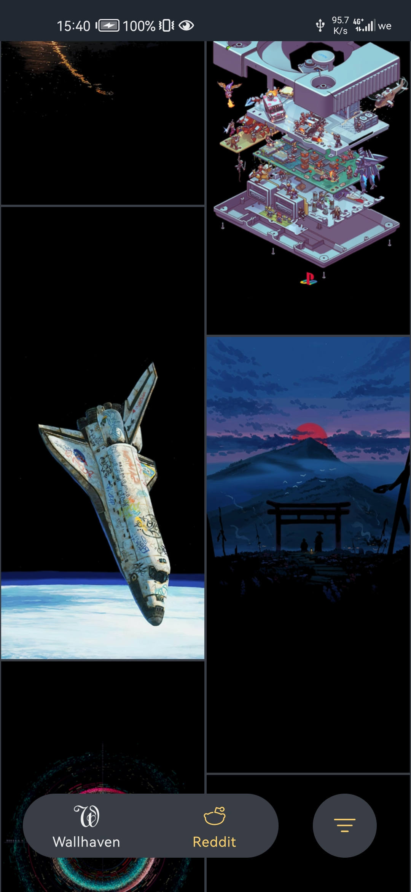
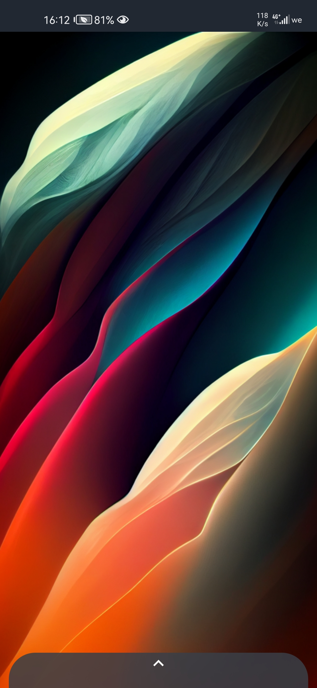

# Wallme-Wallpaper

[<h4 align="center">Support me </h4>](https://www.patreon.com/Alaory)

[<h4 align="center">Discussions</h4>](https://github.com/Alaory/WallMe-Wallpaper/discussions)

## Download

note the fdroid version might be outdated since i update the app frequently

 

 
 

<strong>

Wallme-wallpaper is a wallpaper app that aims to make setting wallpapers easy and without any hassle 
and at the same time have a lot of SFW wallpaper and with a good image quality with support to more than one source of wallpapers

</strong>

### current sources 

Reddit source:

    you can add subreddit's name to view it's posts and set them as wallpaper 
    you can change the list mode from Hot New and Top, you can also change image preview quality for faster image loading  

Wallhaven source:

    you can add tags to your home page to view images of your type, 
    every image contains tags that you can view when you click on them 

## images 

since the app is still in development the ui may change :)

## TODO

- [x] add Reddit support 
- [x] add Reddit filter settings
- [x] add Wallhaven support
- [x] add Wallhaven filter settings 
- [x] add favorite page
- [x] add progress bar when downloading an image
- [ ] add Wallhaven user's posts page
- [x] add landscape and portrait mode //currently only for wallhaven ;(
- [ ] add auto wallpaper changer with the user configuration 
- [ ] add the ability to add images from the device to the favorite page
- [ ] add more UI I SAID MORE
- [ ] more plans coming
- [ ] go to sleep

### libraries

    - coil 
    - okhttp
    - TouchImageView

## Note: 

    this is the first time i use Kotlin for something
    and also my first released android app :) 
    soooo expect a loooooooot of bugs

