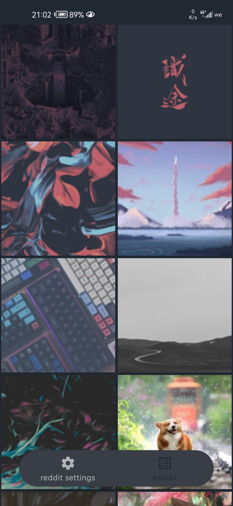

# Wallme-Wallpaper

<a>
<kdb>

</kdb>

</a>

  

 

### what is this ?

 

wallme wallpaper is a wallpaper app aimed at simplicity and low peformance. it can gather images from diffrent sources such as reddit and wallhaven and put them in front of you without any hassle 

  

 

### why i am making it ?

 
well i've used a lot of wallpaper apps only a few of them meet my requirements. so i decided to make it to what i content 

 
 
 
 

### why should i use it 

 

you don't need this app, it is aimed at people who realy want to feel comfortable with using their phones or the one who wants a new feel for their phone

 
 

 

### what does it offer

 

as now of development nothing much. however check the todo list to see the comming features

 
 

###  how does the app look like

 
 
 

 

it needs a lot of work

 
 

 

## TODO

- [x] add reddit support 
- [ ] add reddit settings
- [ ] add more ui I SAID MORE
- [ ] add auto wallpaper changer with preferred croping
- [ ] add wallhaven support
- [ ] more plans comming

### thanks to 
    - coil 
    - okhttp

  for the librays

[<h3>Support me </h3>](https://www.patreon.com/Alaory)
