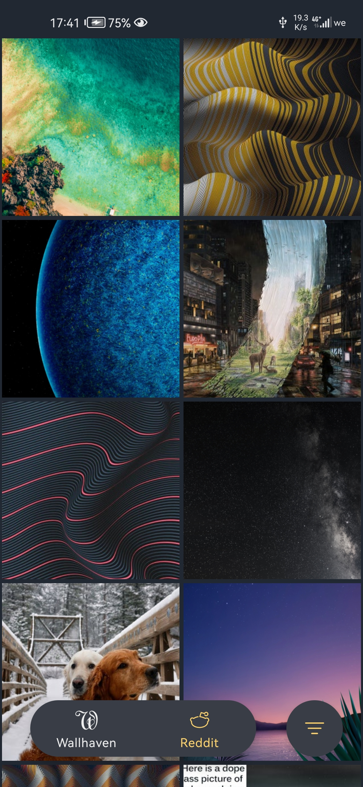
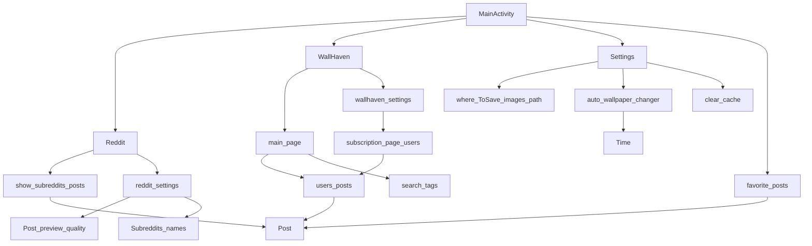

# Wallme-Wallpaper

<a>
<kdb>

</kdb>

</a>

 

[<h2 align="center">Download</h2>](https://github.com/Alaory/WallMe-Wallpaper/releases)

[<h4 align="center">Support me </h4>](https://www.patreon.com/Alaory)

------------------------------------
   

## Note: 

    this is the first time i use kotlin for something
    and also my first released android app :) 
    soooo expect a loooooooot of bugs

 

### what is this ?

 

wallme wallpaper is a wallpaper app aimed at simplicity and low peformance. it can gather images from diffrent sources such as reddit and wallhaven and put them in front of you without any hassle 

  

 

### why i am making it ?

 
well i've used a lot of wallpaper apps only a few of them meet my requirements. so i decided to make one to what i content 

 
 
 
 

### why should i use it 

 

you don't need this app, it is aimed at people who realy want to feel comfortable with using their phones or the one who wants a new feel for their phone

 
 

 

### what does it offer

 

as now of development nothing much. however check the todo list to see the comming features

 
 

###  how does the app look like

 
 
 

 

it needs a lot of work

 
 

 

## TODO

- [x] add reddit support 
- [x] add reddit filter settings
- [x] add wallhaven support
- [ ] add wallhaven filter settings 
- [ ] add landscape mode for tablets
- [ ] add verical mode for phones
- [ ] add favtorite page
- [ ] add wallhaven sub page
- [ ] add prograss bar when downloading an image
- [ ] add auto wallpaper changer with preferred croping
- [ ] add more ui I SAID MORE
- [ ] more plans comming
- [ ] go to sleep

### whats on my mind now for the app

### librays
    - coil 
    - okhttp
    - TouchImageView

